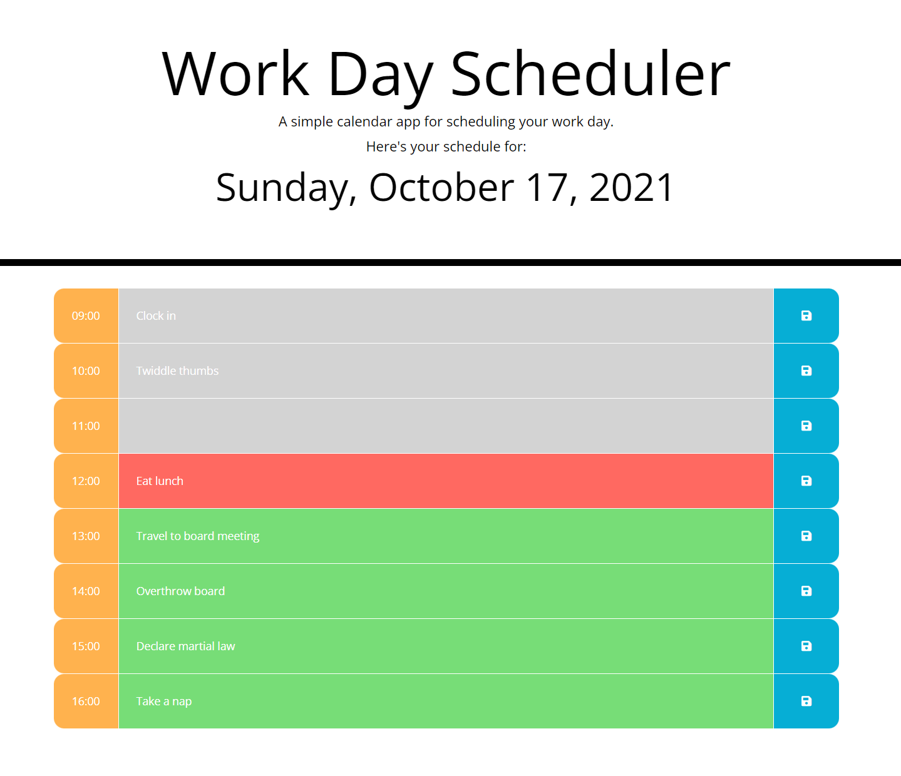

# Workday Scheduler

## Description

This repository is an exercise in using JavaScript date- and time-management libraries to create a workday scheduler. This application uses local storage to save and recall user's schedules. Each hour of the workday is color-coded to indicate whether it is in the past, present, or future.

To guide development of this project, I utilized the following User Story and Acceptance Criteria.

## User Story

```
AS AN employee with a busy schedule
I WANT to add important events to a daily planner
SO THAT I can manage my time effectively
```

## Acceptance Criteria

```
GIVEN I am using a daily planner to create a schedule
WHEN I open the planner
THEN the current day is displayed at the top of the calendar
WHEN I scroll down
THEN I am presented with time blocks for standard business hours
WHEN I view the time blocks for that day
THEN each time block is color-coded to indicate whether it is in the past, present, or future
WHEN I click into a time block
THEN I can enter an event
WHEN I click the save button for that time block
THEN the text for that event is saved in local storage
WHEN I refresh the page
THEN the saved events persist
```

## Built With

* HTML
* CSS
* JavaScript
* jQuery
* Bootstrap
* Luxon

## Website

<https://thorulfr.github.io/workday-scheduler/>

## Screenshot



## Contribution

Initial skeleton HTML and CSS provided at outset (see initial commit). All other code by Benjamin Holt.
